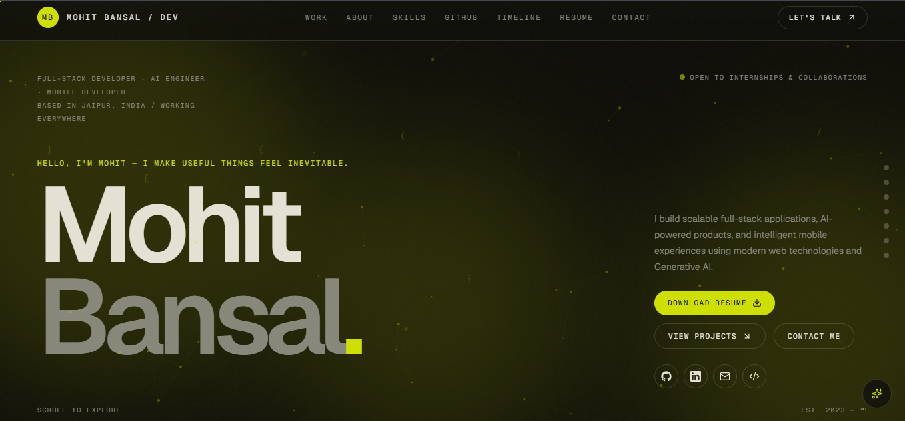

<p align="center">
  
</p>

<h1 align="center">
  
</h1>

<p align="center">
  <a href="https://mohitbansal-kohl.vercel.app/" target="_blank">
    
  </a>
  <a href="https://github.com/mohitbansal/portfolio-website" target="_blank">
    
  </a>
</p>

<p align="center">
  
  
  
  
  
</p>

---

## 🌟 Overview

A single-page, highly interactive portfolio built for **Mohit Bansal**. This isn't just a static resume—it's a real-time web application featuring live GitHub API integration, an advanced cross-platform resume PDF viewer, a custom-built image lightbox, and 6 fully swappable color themes.

🚀 **Live Site:** [https://mohitbansal-kohl.vercel.app/](https://mohitbansal-kohl.vercel.app/)

## ✨ Key Features

### 🎨 Design & Experience
- **6 Swappable Color Themes:** Midnight, Cyberpunk, Glass, Minimal, Neon, and Ocean. Driven entirely by `oklch()` CSS custom properties and switched instantly via a `data-theme` attribute.
- **Scroll-Triggered Animations:** Custom `<Reveal>` wrapper using `IntersectionObserver` for buttery-smooth fade/slide-ins.
- **3D Interactive Tech Sphere:** A rotating sphere of tech-stack tags that follows the mouse and auto-spins.
- **Aurora & Grain Backgrounds:** Subtle SVG noise overlay and blurred animated color blobs for visual depth.
- **Animated Stats:** Count-up cards that trigger when scrolled into view.

### 💻 Advanced Functionality
- **Live GitHub Integration:** Real-time data fetching via GraphQL & REST APIs.
- **In-Browser PDF Viewer:** Canvas-rendered resume viewer replacing unreliable native `<iframe>` plugins.
- **Custom Image Lightbox:** A zero-dependency, mobile-safe full-screen image viewer.

---

## 📸 Deep Dive: Custom Viewers

Both the Resume and Projects sections required handling complex media on mobile devices without breaking the UI. I built two custom viewers from scratch to solve this.

<details>
  <summary><b>📄 Advanced Resume PDF Viewer (Click to expand)</b></summary>
  <br/>
  
  **The Problem:** Mobile browsers (especially in-app WebViews like Instagram/LinkedIn) lack PDF plugins. An `<iframe src="/resume.pdf">` silently renders blank on these devices.
  
  **The Solution:** A client-side PDF viewer built on `pdfjs-dist` (the engine powering Firefox/Chrome).
  - **Inline Thumbnail Card:** Renders a live page 1 thumbnail to `<canvas>` with a tilt-on-hover effect.
  - **Full-Screen Modal:** Continuous scroll through all pages, lazy-rendered via `IntersectionObserver`.
  - **Gestures:** 
    - Desktop: `Ctrl/Cmd + scroll` to zoom, click-and-drag to pan.
    - Mobile: Pinch-to-zoom, one-finger drag to pan, double-tap to toggle zoom.
  - **Navigation:** Prev/next buttons, jump-to-page input, `←`/`→`/`PageUp`/`PageDown`/`Esc` keyboard shortcuts.
  - **Actions:** Download, open in new tab, print, and rotate (90° increments).
  - **Dynamic Viewport:** Uses `100dvh` and `min-h-0` flexbox to prevent mobile browser chrome from clipping the UI.
</details>

<details>
  <summary><b>🖼️ Project Image Viewer (Click to expand)</b></summary>
  <br/>
  
  **The Problem:** Projects like "DeepDive AI" have 12 screenshots. Standard lightboxes overflow or clip navigation arrows on mobile.
  
  **The Solution:** A standalone, reusable `ImageViewer` component built on native pointer/touch events.
  - **Mobile-Safe:** One-finger swipe to navigate, pinch-to-zoom, double-tap to toggle 100% ↔ 200%.
  - **Desktop-Safe:** `←`/`→` keys, `Esc` to close, `Ctrl/Cmd + scroll` zoom (up to 4×), click-and-drag to pan.
  - **Deterministic Flexbox:** Replaced unpredictable `absolute` positioning with a centered flex layout to ensure the image and arrows render perfectly every time.
  - **Smart Thumbnails:** Thumbnail strip only renders if the project has ≤ 8 images to prevent UI overflow.
</details>

---

## 🐙 Live GitHub Section

Unlike the rest of the site (which is static), this section pulls **real, real-time data** from GitHub on every load, cached at the edge.

- **Stat Cards:** Public repos, total stars, all-time contributions, longest streak.
- **Contribution Heatmap:** Selectable year dropdown, aligned month labels, click any day to view actual commits in a modal.
- **Language Breakdown:** Byte-weighted color bar of every language used across all repositories.
- **Pinned Repos & Activity Feed:** Live stars/forks, recent push/PR/issue events.
- **Manual Refresh:** Bypasses server/edge cache to force a fresh network fetch.

---

## 🛠️ Tech Stack

| Category | Technology |
| --- | --- |
| **Framework** | Next.js 16 (App Router, Turbopack) |
| **Language** | TypeScript |
| **Styling** | Tailwind CSS v4, `oklch()` CSS Variables |
| **UI Primitives** | `@base-ui/react`, `class-variance-authority`, `lucide-react` |
| **PDF Rendering** | `pdfjs-dist` (Canvas-based, client-side) |
| **Backend / API** | Next.js Route Handlers (GitHub GraphQL v4, REST v3) |
| **Email** | Nodemailer (Gmail SMTP) |
| **Analytics** | `@vercel/analytics` |
| **Deployment** | Vercel |

---

## 📂 Project Architecture

```text
portfolio-website/
├── app/
│   ├── api/                  # Next.js Route Handlers
│   │   ├── contact/          # Nodemailer email integration
│   │   └── github/           # GitHub GraphQL/REST API proxy
│   ├── globals.css           # Theme tokens, base styles, animations
│   └── layout.tsx            # Root layout, fonts, metadata
├── components/
│   ├── portfolio-site.tsx    # Main page assembly & sections
│   ├── image-viewer.tsx      # ★ Custom mobile-safe image lightbox
│   ├── pdf-viewer.tsx        # ★ Advanced pdfjs-dist viewer
│   ├── github-section.tsx    # Live GitHub data UI
│   └── ui/button.tsx         # Shared button component
├── hooks/
│   ├── use-github-profile.ts # Fetches /api/github
│   └── use-day-commits.ts    # Fetches day-specific commits
├── lib/
│   ├── content.ts            # Single source of truth for static content
│   ├── github.ts             # Server-only GitHub client
│   └── utils.ts              # cn() classname helper
└── public/
    └── resume.pdf            # Resume rendered by the PDF viewer
```

---

## ⚙️ Environment Variables

To run this project locally, you will need to set up the following environment variables in a `.env.local` file. See `.env.local.example` for the template.

| Variable | Purpose |
| --- | --- |
| `GITHUB_TOKEN` | Fine-grained GitHub PAT (public repos + followers, read-only). |
| `GITHUB_USERNAME` | Default GitHub login if `?username=` isn't passed. |
| `EMAIL_USER` | Gmail address the contact form sends from/to. |
| `EMAIL_PASS` | Gmail App Password for Nodemailer auth. |

> **Note:** The PDF viewer and Image viewer require **no** environment variables. They work entirely client-side against static assets.

---

## 🚀 Getting Started

### 1. Clone the repository
```bash
git clone https://github.com/mohitbansal/portfolio-website.git
cd portfolio-website
```

### 2. Install dependencies
This project uses `pdfjs-dist` for the resume viewer.
```bash
npm install
# or
pnpm install
```

### 3. Set up environment variables
Copy the example file and fill in your details:
```bash
cp .env.local.example .env.local
```

### 4. Run the development server
```bash
npm run dev
```
Open [http://localhost:3000](http://localhost:3000) to view it in your browser.

---

## 🤝 Connect With Me

<p align="center">
  <a href="https://mohitbansal-kohl.vercel.app/"></a>
  <a href="https://github.com/mohitbansal25082006"></a>
  <a href="https://www.linkedin.com/in/mohit-bansal-383440315"></a>
  <a href="mailto:mohitbansal2508@gmail.com"></a>
</p>

---

<p align="center">
  Built with ❤️, ☕, and a lot of <code>100dvh</code> bug fixes by Mohit Bansal.
</p>
```
